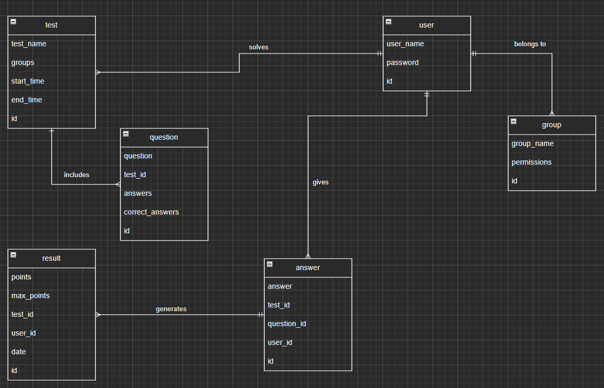

# Platforma do rozwiązywania quizów

Nasza aplikacja służy do weryfikowania wiedzy uczniów w ramach opracowanych przez nauczycieli testów. Każdy z zalogowanych użytkowników będzie posiadać przypisaną grupę charakteryzującą się odpowiednimi uprawnieniami. Informacje o użytkownikach, testach i wynikach będą przechowywane w bazie danych. Testy jednostkowe kontrolujące pomyślny przebieg operacji będą wykonywane w języku JavaScript.
## Funkcjonalności:
1. **Tworzenie konta** – rejestrujący się użytkownik podaje swoje dane: login i hasło. Po utworzeniu konta zostaje mu przypisana podstawowa grupa „Uczeń”, możliwa do podmiany przez administratora.
2. **Autentykacja** – w ramach logowania się użytkownik podaje login i hasło. Następnie aplikacja wysyła do bazy danych zapytanie odnośnie poprawności wprowadzonych informacji.
3. **Tworzenie quizów** – testy są tworzone za pomocą formularza i następnie przesyłane do bazy danych w postaci obiektu JSON.
4. **Przeglądanie quizów** – zostają pobrane wszystkie testy, spośród których użytkownik może wybrać ten, który chce wykonać. 
5. **Rozwiązywanie quizów** – test wyświetla się jako kolejne pytania z określoną liczbą możliwych odpowiedzi. Pytanie może być wielokrotnego wyboru.
6. **Podgląd wyników** – wyświetlone zostają wszystkie dostępne wyniki. Za pomocą pól tekstowych i przycisku „Szukaj” użytkownik ma możliwość filtrowania rezultatów na podstawie nazwy użytkownika lub testu.
7. **Zarządzanie bazą** – administrator ma prawo przydzielać użytkownikom grupy, zmieniać zakres uprawnień poszczególnych grup i usuwać testy.

[Dokumentacja Swagger](https://app.swaggerhub.com/apis-docs/IreneuszSob/test-platform-server-api/1.0.0)

## Podział prac:
**Ireneusz Sobol**:
Opracowanie frontendu aplikacji oraz testów jednostkowych rozwiązywania quizów  
**Adrian Tarza**:
Przygotowanie bazy danych i jej dokumentacji oraz testów jednostkowych połączenia z serwerem  
**Tomasz Tarnowski**:
Opracowanie serwera Node, jego testów jednostkowych oraz dokumentacji API w Swaggerze  